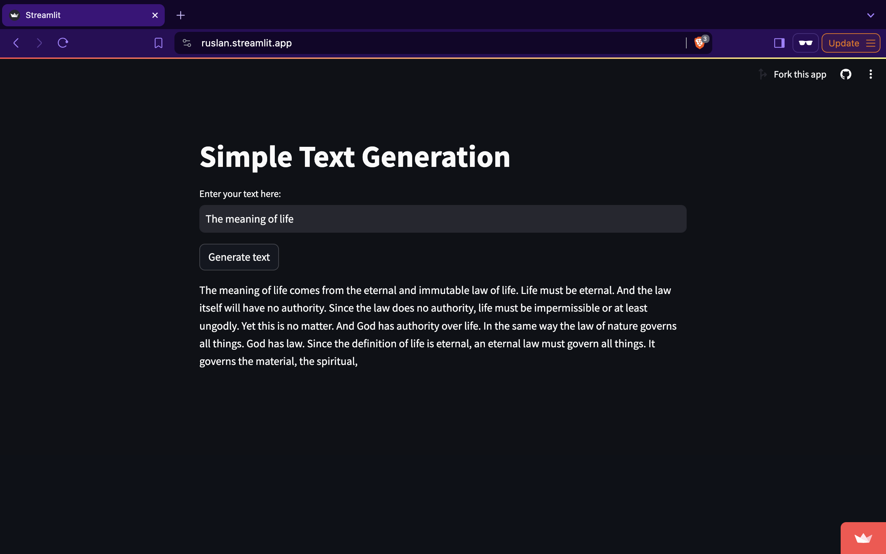

# Text Generation Web App

The app is built and hosted by Streamlit. You can use it to generate a text as a response to a prompt. The generative model is GPT-2 provided by HuggingFace.

## Building and deploying
Streamlit provides a framework on creating data app. For this, it requires the app logic specified in a Python script and requirements in a text document. You can test the app locally:

######
streamlit run app.py

To deploy, create Streamlit account and connect GitHub account to it -> follow the link: https://share.streamlit.io/ -> "New App" -> Choose your GitHub repository

### Example of the app execution

Alas, the response of GPT-2 is usually quite random.